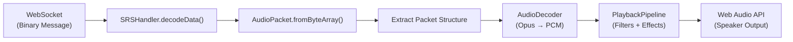

# Deep Dive into DCSOlympus Decoders

## 1. Decoder File Locations

The DCSOlympus project contains **four main decoder implementations** across different parts of the system:

### Audio System Decoders (TypeScript)
- **Client-side Audio Decoder**: [1](#0-0) 
- **Client-side Audio Packet Decoder**: [2](#0-1) 
- **Server-side Audio Packet Decoder**: [3](#0-2) 
- **Server-side SRS Handler Decoder**: [4](#0-3) 

### DCS Data Decoder (Python)
- **Binary Data Extractor**: [5](#0-4) 

### Utility Functions (Required Dependencies)
- **Client-side Byte Conversion Utils**: [6](#0-5) 
- **Server-side Byte Conversion Utils**: [7](#0-6) 

---

## 2. Decoder Implementation Details

### 2.1 Web Audio API Opus Decoder (PlaybackPipeline)

**Purpose**: Decodes Opus-encoded audio data received from SRS (SimpleRadio Standalone) into playable PCM audio.

**Configuration**: [8](#0-7) 

**Key Specifications**:
- Codec: Opus
- Sample Rate: 16kHz
- Channels: Mono (1 channel)
- Frame Duration: 40ms (40000 microseconds)
- Bitrate Mode: Constant

**Audio Processing Pipeline**: The decoder includes sophisticated audio processing with bandpass filters (520Hz low cutoff, 5000Hz high cutoff), gain nodes, stereo panning, and white noise injection to simulate radio static. [9](#0-8) 

**Decoding Process**: [10](#0-9) 

---

### 2.2 Audio Packet Binary Decoder (AudioPacket)

**Purpose**: Decodes binary packet data into structured audio packet format containing frequencies, modulation, encryption, audio data, unit IDs, GUIDs, and hop counts.

**Packet Structure Decoded**:
1. Total packet length (2 bytes)
2. Audio data length (2 bytes)
3. Frequencies data length (2 bytes)
4. Audio data (variable length)
5. Frequencies array (10 bytes per frequency: 8-byte double frequency + 1-byte modulation + 1-byte encryption)
6. Unit ID (4 bytes)
7. Packet ID (8 bytes)
8. Hops count (1 byte)
9. Transmission GUID (22 bytes UTF-8 string)
10. Client GUID (22 bytes UTF-8 string)

**Client-side Implementation**: [11](#0-10) 

**Server-side Implementation**: [12](#0-11) 

**Validation**: Both implementations include sanity checks for packet length and frequency data integrity. [13](#0-12) 

---

### 2.3 SRS Handler Message Decoder

**Purpose**: Decodes incoming WebSocket messages from clients, handling both audio packets and settings updates.

**Message Types Handled**:
- `MessageType.audio`: Binary audio packets for transmission to SRS server
- `MessageType.settings`: JSON radio configuration updates (GUID, coalition, radio frequencies/modulation)

**Implementation**: [4](#0-3) 

**Audio Flow**: The decoder validates packet length (minimum 22 bytes), creates an AudioPacket instance, decodes it, and forwards to the SRS UDP server. [14](#0-13) 

---

### 2.4 DCS Binary Data Extractor (Python)

**Purpose**: Decodes binary data exported from DCS (Digital Combat Simulator) for units, weapons, and mission data.

**Supported Data Types**:
- Primitive types: bool, uint8, uint16, uint32, uint64, float64
- Complex types: strings (with UTF-8 encoding), lat/lng coordinates, TACAN data, radio data, general settings, ammunition, contacts, paths, offsets, draw arguments

**Key Methods**: [15](#0-14) 

**String Handling**: Includes robust UTF-8 decoding with null terminator detection and error handling. [16](#0-15) 

**Complex Type Extraction**: [17](#0-16) 

---

## 3. Migration Tips and Best Practices

### ⚠️ Important Considerations

**DO NOT simply copy files**. Here's why and what you should do:

### 3.1 Audio Packet Decoder Migration

**Critical Issue**: The code is duplicated between client and server. [18](#0-17) 

**Recommendation**: 
- Create a **shared module/package** for the AudioPacket class
- Both implementations are identical except for import paths
- Consider using a monorepo tool (pnpm workspaces, npm workspaces, or Yarn workspaces) to share this code
- This will eliminate maintenance burden of keeping two versions in sync

### 3.2 Byte Conversion Utilities

**Required Dependencies**: The AudioPacket decoders depend on byte conversion utilities. [19](#0-18) 

**Migration Checklist**:
1. ✅ Copy `byteArrayToInteger()` - Converts little-endian byte arrays to integers
2. ✅ Copy `integerToByteArray()` - Converts integers to little-endian byte arrays
3. ✅ Copy `doubleToByteArray()` - Converts IEEE 754 doubles to byte arrays
4. ✅ Copy `byteArrayToDouble()` - Converts byte arrays to IEEE 754 doubles
5. ✅ Ensure both client and server have access to these utilities

**Note**: These functions use **little-endian byte order**. [7](#0-6) 

### 3.3 Web Audio API Decoder (PlaybackPipeline)

**Browser Dependency**: This decoder uses the **WebCodecs API** (`AudioDecoder`) which requires:
- Chrome 94+, Edge 94+, Opera 80+ (as of 2021)
- NOT supported in Firefox or Safari
- Requires HTTPS in production

**Audio Context Dependencies**: [20](#0-19) 

**Migration Steps**:
1. Ensure your service has browser compatibility requirements met
2. Import the `Filter` and `Noise` classes from audiolibrary.ts
3. Verify you have access to an AudioContext (usually via an AudioManager)
4. Maintain the exact Opus decoder configuration (16kHz, mono, 40ms frames) for SRS compatibility

### 3.4 SRS Handler Decoder

**External Dependencies**:
- Node.js `net` module for TCP socket
- Node.js `dgram` module for UDP socket
- WebSocket library for client communication

**Integration Points**: [21](#0-20) 

**Migration Steps**:
1. Copy the entire `SRSHandler` class
2. Ensure you have the `defaultSRSData` configuration
3. Update SRS server IP/port configuration for your environment
4. Maintain the SRS protocol version compatibility [22](#0-21) 

### 3.5 Python Data Extractor

**Clean Implementation**: This is the most portable decoder - has minimal dependencies (only Python's `struct` module and custom data types).

**Migration Steps**:
1. Copy `data_extractor.py`
2. Copy `data_types.py` (contains LatLng, TACAN, Radio, etc. definitions)
3. This decoder is **completely independent** from the audio system

**Usage Pattern**: Initialize with a bytes buffer, then call extraction methods which automatically advance the internal seek position. [23](#0-22) 

---

## 4. Architecture Integration Notes

### Audio Decoder Data Flow

The decoders work together in this sequence:



**Client-side Usage**: [24](#0-23) 

---

## 5. Testing Recommendations

Before migrating, ensure you test:

1. **Byte Order**: Verify your target system uses little-endian encoding
2. **Audio Format**: Test with actual Opus-encoded SRS audio packets
3. **WebSocket Protocol**: Ensure message framing matches (first byte is message type enum)
4. **Browser Compatibility**: Test WebCodecs API availability in your target browsers
5. **SRS Protocol**: Verify SRS server version compatibility (currently targets v2.1.0.10)

---

## Notes

- The **audio decoders are tightly coupled to the SRS radio system** - they're specifically designed for SRS (SimpleRadio Standalone) integration, not generic audio decoding
- The **Python data extractor is separate** from the audio system and handles DCS mission/unit data
- There's **technical debt** with the duplicated AudioPacket code that should be addressed during migration
- The Web Audio API decoder includes sophisticated radio simulation effects (bandpass filters, static noise) that you may or may not need depending on your use case
- Consider using TypeScript's type system to ensure type safety when integrating these decoders into your service

### Citations

**File:** frontend/react/src/audio/playbackpipeline.ts (L1-119)
```typescript
import { getApp } from "../olympusapp";
import { Filter, Noise } from "./audiolibrary";

export class PlaybackPipeline {
  #decoder = new AudioDecoder({
    output: (chunk) => this.#handleDecodedData(chunk),
    error: (e) => console.log(e),
  });
  #trackGenerator: any; // TODO can we have typings?
  #writer: any;
  #gainNode: GainNode;
  #pannerNode: StereoPannerNode;
  #enabled: boolean = false;

  constructor() {
    this.#decoder.configure({
      codec: "opus",
      numberOfChannels: 1,
      sampleRate: 16000,
      //@ts-ignore // TODO why is this giving an error?
      opus: {
        frameDuration: 40000,
      },
      bitrateMode: "constant",
    });

    //@ts-ignore
    this.#trackGenerator = new MediaStreamTrackGenerator({ kind: "audio" });
    this.#writer = this.#trackGenerator.writable.getWriter();

    const stream = new MediaStream([this.#trackGenerator]);
    const mediaStreamSource = getApp().getAudioManager().getAudioContext().createMediaStreamSource(stream);

    /* Connect to the device audio output */
    this.#gainNode = getApp().getAudioManager().getAudioContext().createGain();
	this.#gainNode.gain.value = 40;// apply gain to get clipping
	
	const volumeNode = getApp().getAudioManager().getAudioContext().createGain();
	volumeNode.gain.value = 0.1; // Lower output volume to prevent feedback
	
    this.#pannerNode = getApp().getAudioManager().getAudioContext().createStereoPanner();
    let splitter = getApp().getAudioManager().getAudioContext().createChannelSplitter();

    // Bandpass filter for low frequency cutoff at 520 Hz same as SRS
    let bandpassLow = new Filter(getApp().getAudioManager().getAudioContext(), "bandpass", 520, 0.25);
    bandpassLow.setup();

    // Bandpass filter for high frequency cutoff at 4130 Hz same as SRS
    let bandpassHigh = new Filter(getApp().getAudioManager().getAudioContext(), "bandpass", 5000, 0.3);
    bandpassHigh.setup();

    // Distortion effect
    let distortion = getApp().getAudioManager().getAudioContext().createWaveShaper();
    distortion.curve = this.#createDistortionCurve(2); // Customize curve for harshness
    distortion.oversample = '4x';
	

/*     // Connect the media stream source to the filters and distortion
	mediaStreamSource.connect(this.#gainNode);
	this.#gainNode.connect(this.#pannerNode);
	this.#pannerNode.pan.setValueAtTime(0, getApp().getAudioManager().getAudioContext().currentTime); */
	
	mediaStreamSource.connect(this.#gainNode);
	this.#gainNode.connect(bandpassHigh.input);
	//bandpassLow.output.connect(bandpassHigh.input);
	bandpassHigh.output.connect(volumeNode); // Control volume to prevent feedback
	volumeNode.connect(this.#pannerNode); // Route to panner
    this.#pannerNode.pan.setValueAtTime(0, getApp().getAudioManager().getAudioContext().currentTime);

    let noise = new Noise(getApp().getAudioManager().getAudioContext(), 0.02); // Slightly louder static
    noise.init();
    noise.connect(this.#gainNode);
  }

  playBuffer(arrayBuffer) {
    const init = {
      type: "key",
      data: arrayBuffer,
      timestamp: 0,
      duration: 2000000,
      transfer: [arrayBuffer],
    };
    //@ts-ignore //TODO Typings?
    let encodedAudioChunk = new EncodedAudioChunk(init);
    
    this.#decoder.decode(encodedAudioChunk); 
  }

  setEnabled(enabled) {
    if (enabled && !this.#enabled) {
      this.#enabled = true;
      this.#pannerNode.connect(getApp().getAudioManager().getAudioContext().destination);
    } else if (!enabled && this.#enabled) {
      this.#enabled = false;
      this.#pannerNode.disconnect(getApp().getAudioManager().getAudioContext().destination);
    }
  }

  setPan(pan) {
    this.#pannerNode.pan.setValueAtTime(pan, getApp().getAudioManager().getAudioContext().currentTime);
  }

  #handleDecodedData(audioData) {
    this.#writer.ready.then(() => {
      this.#writer.write(audioData);
    });
  }

  #createDistortionCurve(amount) {
    let n_samples = 44100;
    let curve = new Float32Array(n_samples);
    let deg = Math.PI / 180;
    for (let i = 0; i < n_samples; ++i) {
      let x = (i * 2) / n_samples - 1;
      curve[i] = ((3 + amount) * x * 20 * deg) / (Math.PI + amount * Math.abs(x));
    }
    return curve;
  }
}
```

**File:** frontend/react/src/audio/audiopacket.ts (L1-210)
```typescript
// TODO This code is in common with the backend, would be nice to share it */
import { byteArrayToDouble, byteArrayToInteger, doubleToByteArray, integerToByteArray } from "../other/utils";
import { Buffer } from "buffer";

var packetID = 0;

export enum MessageType {
  audio,
  settings,
  clientsData
}

export class AudioPacket {
  /* Mandatory data */
  #frequencies: { frequency: number; modulation: number; encryption: number }[] = [];
  #audioData: Uint8Array;
  #transmissionGUID: string;
  #clientGUID: string;

  /* Default data */
  #unitID: number = 0;
  #hops: number = 0;

  /* Usually internally set only */
  #packetID: number | null = null;

  fromByteArray(byteArray: Uint8Array) {
    let totalLength = byteArrayToInteger(byteArray.slice(0, 2));
    let audioLength = byteArrayToInteger(byteArray.slice(2, 4));
    let frequenciesLength = byteArrayToInteger(byteArray.slice(4, 6));

    /* Perform some sanity checks */
    if (totalLength !== byteArray.length) {
      console.log(
        `Warning, audio packet expected length is ${totalLength} but received length is ${byteArray.length}, aborting...`
      );
      return;
    }

    if (frequenciesLength % 10 !== 0) {
      console.log(
        `Warning, audio packet frequencies data length is ${frequenciesLength} which is not a multiple of 10, aborting...`
      );
      return;
    }

    /* Extract the audio data */
    this.#audioData = byteArray.slice(6, 6 + audioLength);

    /* Extract the frequencies */
    let offset = 6 + audioLength;
    for (let idx = 0; idx < frequenciesLength / 10; idx++) {
      this.#frequencies.push({
        frequency: byteArrayToDouble(byteArray.slice(offset, offset + 8)),
        modulation: byteArray[offset + 8],
        encryption: byteArray[offset + 9],
      });
      offset += 10;
    }

    /* Extract the remaining data */
    this.#unitID = byteArrayToInteger(byteArray.slice(offset, offset + 4));
    offset += 4;
    this.#packetID = byteArrayToInteger(byteArray.slice(offset, offset + 8));
    offset += 8;
    this.#hops = byteArrayToInteger(byteArray.slice(offset, offset + 1));
    offset += 1;
    this.#transmissionGUID = new TextDecoder().decode(byteArray.slice(offset, offset + 22));
    offset += 22;
    this.#clientGUID = new TextDecoder().decode(byteArray.slice(offset, offset + 22));
    offset += 22;
  }

  toByteArray() {
    /* Perform some sanity checks // TODO check correct values */
    if (this.#frequencies.length === 0) {
      console.log(
        "Warning, could not encode audio packet, no frequencies data provided, aborting..."
      );
      return;
    }

    if (this.#audioData === undefined) {
      console.log(
        "Warning, could not encode audio packet, no audio data provided, aborting..."
      );
      return;
    }

    if (this.#transmissionGUID === undefined) {
      console.log(
        "Warning, could not encode audio packet, no transmission GUID provided, aborting..."
      );
      return;
    }

    if (this.#clientGUID === undefined) {
      console.log(
        "Warning, could not encode audio packet, no client GUID provided, aborting..."
      );
      return;
    }

    // Prepare the array for the header
    let header: number[] = [0, 0, 0, 0, 0, 0];

    // Encode the frequencies data
    let frequenciesData = [] as number[];
    this.#frequencies.forEach((data) => {
      frequenciesData = frequenciesData.concat(
        [...doubleToByteArray(data.frequency)],
        [data.modulation],
        [data.encryption]
      );
    });

	/* If necessary increase the packetID */
    if (this.#packetID === null) this.#packetID = packetID++;

    // Encode unitID, packetID, hops
    let encUnitID: number[] = integerToByteArray(this.#unitID, 4);
    let encPacketID: number[] = integerToByteArray(this.#packetID, 8);
    let encHops: number[] = [this.#hops];

    // Assemble packet
    let encodedData: number[] = ([] as number[]).concat(
      header,
      [...this.#audioData],
      frequenciesData,
      encUnitID,
      encPacketID,
      encHops,
      [...Buffer.from(this.#transmissionGUID, "utf-8")],
      [...Buffer.from(this.#clientGUID, "utf-8")]
    );

    // Set the lengths of the parts
    let encPacketLen = integerToByteArray(encodedData.length, 2);
    encodedData[0] = encPacketLen[0];
    encodedData[1] = encPacketLen[1];

    let encAudioLen = integerToByteArray(this.#audioData.length, 2);
    encodedData[2] = encAudioLen[0];
    encodedData[3] = encAudioLen[1];

    let frequencyAudioLen = integerToByteArray(frequenciesData.length, 2);
    encodedData[4] = frequencyAudioLen[0];
    encodedData[5] = frequencyAudioLen[1];

    return new Uint8Array([0].concat(encodedData));
  }

  setFrequencies(
    frequencies: { frequency: number; modulation: number; encryption: number }[]
  ) {
    this.#frequencies = frequencies;
  }

  getFrequencies() {
    return this.#frequencies;
  }

  setAudioData(audioData: Uint8Array) {
    this.#audioData = audioData;
  }

  getAudioData() {
    return this.#audioData;
  }

  setTransmissionGUID(transmissionGUID: string) {
    this.#transmissionGUID = transmissionGUID;
  }

  getTransmissionGUID() {
    return this.#transmissionGUID;
  }

  setClientGUID(clientGUID: string) {
    this.#clientGUID = clientGUID;
  }

  getClientGUID() {
    return this.#clientGUID;
  }

  setUnitID(unitID: number) {
    this.#unitID = unitID;
  }

  getUnitID() {
    return this.#unitID;
  }

  setPacketID(packetID: number) {
    this.#packetID = packetID;
  }

  getPacketID() {
    return this.#packetID;
  }

  setHops(hops: number) {
    this.#hops = hops;
  }

  getHops() {
    return this.#hops;
  }
}
```

**File:** frontend/server/src/audio/audiopacket.ts (L1-210)
```typescript
// TODO This code is in common with the frontend, would be nice to share it */
import { byteArrayToDouble, byteArrayToInteger, doubleToByteArray, integerToByteArray } from "../utils";
import { Buffer } from "buffer";

var packetID = 0;

export enum MessageType {
  audio,
  settings,
  clientsData
}

export class AudioPacket {
  /* Mandatory data */
  #frequencies: { frequency: number; modulation: number; encryption: number }[] = [];
  #audioData: Uint8Array;
  #transmissionGUID: string;
  #clientGUID: string;

  /* Default data */
  #unitID: number = 0;
  #hops: number = 0;

  /* Usually internally set only */
  #packetID: number | null = null;

  fromByteArray(byteArray: Uint8Array) {
    let totalLength = byteArrayToInteger(byteArray.slice(0, 2));
    let audioLength = byteArrayToInteger(byteArray.slice(2, 4));
    let frequenciesLength = byteArrayToInteger(byteArray.slice(4, 6));

    /* Perform some sanity checks */
    if (totalLength !== byteArray.length) {
      console.log(
        `Warning, audio packet expected length is ${totalLength} but received length is ${byteArray.length}, aborting...`
      );
      return;
    }

    if (frequenciesLength % 10 !== 0) {
      console.log(
        `Warning, audio packet frequencies data length is ${frequenciesLength} which is not a multiple of 10, aborting...`
      );
      return;
    }

    /* Extract the audio data */
    this.#audioData = byteArray.slice(6, 6 + audioLength);

    /* Extract the frequencies */
    let offset = 6 + audioLength;
    for (let idx = 0; idx < frequenciesLength / 10; idx++) {
      this.#frequencies.push({
        frequency: byteArrayToDouble(byteArray.slice(offset, offset + 8)),
        modulation: byteArray[offset + 8],
        encryption: byteArray[offset + 9],
      });
      offset += 10;
    }

    /* If necessary increase the packetID */
    if (this.#packetID === null) this.#packetID = packetID++;

    /* Extract the remaining data */
    this.#unitID = byteArrayToInteger(byteArray.slice(offset, offset + 4));
    offset += 4;
    this.#packetID = byteArrayToInteger(byteArray.slice(offset, offset + 8));
    offset += 8;
    this.#hops = byteArrayToInteger(byteArray.slice(offset, offset + 1));
    offset += 1;
    this.#transmissionGUID = new TextDecoder().decode(byteArray.slice(offset, offset + 22));
    offset += 22;
    this.#clientGUID = new TextDecoder().decode(byteArray.slice(offset, offset + 22));
    offset += 22;
  }

  toByteArray() {
    /* Perform some sanity checks // TODO check correct values */
    if (this.#frequencies.length === 0) {
      console.log(
        "Warning, could not encode audio packet, no frequencies data provided, aborting..."
      );
      return;
    }

    if (this.#audioData === undefined) {
      console.log(
        "Warning, could not encode audio packet, no audio data provided, aborting..."
      );
      return;
    }

    if (this.#transmissionGUID === undefined) {
      console.log(
        "Warning, could not encode audio packet, no transmission GUID provided, aborting..."
      );
      return;
    }

    if (this.#clientGUID === undefined) {
      console.log(
        "Warning, could not encode audio packet, no client GUID provided, aborting..."
      );
      return;
    }

    // Prepare the array for the header
    let header: number[] = [0, 0, 0, 0, 0, 0];

    // Encode the frequencies data
    let frequenciesData = [] as number[];
    this.#frequencies.forEach((data) => {
      frequenciesData = frequenciesData.concat(
        [...doubleToByteArray(data.frequency)],
        [data.modulation],
        [data.encryption]
      );
    });

    // Encode unitID, packetID, hops
    let encUnitID: number[] = integerToByteArray(this.#unitID, 4);
    let encPacketID: number[] = integerToByteArray(this.#packetID, 8);
    let encHops: number[] = [this.#hops];

    // Assemble packet
    let encodedData: number[] = ([] as number[]).concat(
      header,
      [...this.#audioData],
      frequenciesData,
      encUnitID,
      encPacketID,
      encHops,
      [...Buffer.from(this.#transmissionGUID, "utf-8")],
      [...Buffer.from(this.#clientGUID, "utf-8")]
    );

    // Set the lengths of the parts
    let encPacketLen = integerToByteArray(encodedData.length, 2);
    encodedData[0] = encPacketLen[0];
    encodedData[1] = encPacketLen[1];

    let encAudioLen = integerToByteArray(this.#audioData.length, 2);
    encodedData[2] = encAudioLen[0];
    encodedData[3] = encAudioLen[1];

    let frequencyAudioLen = integerToByteArray(frequenciesData.length, 2);
    encodedData[4] = frequencyAudioLen[0];
    encodedData[5] = frequencyAudioLen[1];

    return new Uint8Array([0].concat(encodedData));
  }

  setFrequencies(
    frequencies: { frequency: number; modulation: number; encryption: number }[]
  ) {
    this.#frequencies = frequencies;
  }

  getFrequencies() {
    return this.#frequencies;
  }

  setAudioData(audioData: Uint8Array) {
    this.#audioData = audioData;
  }

  getAudioData() {
    return this.#audioData;
  }

  setTransmissionGUID(transmissionGUID: string) {
    this.#transmissionGUID = transmissionGUID;
  }

  getTransmissionGUID() {
    return this.#transmissionGUID;
  }

  setClientGUID(clientGUID: string) {
    this.#clientGUID = clientGUID;
  }

  getClientGUID() {
    return this.#clientGUID;
  }

  setUnitID(unitID: number) {
    this.#unitID = unitID;
  }

  getUnitID() {
    return this.#unitID;
  }

  setPacketID(packetID: number) {
    this.#packetID = packetID;
  }

  getPacketID() {
    return this.#packetID;
  }

  setHops(hops: number) {
    this.#hops = hops;
  }

  getHops() {
    return this.#hops;
  }
}
```

**File:** frontend/server/src/audio/srshandler.ts (L5-9)
```typescript
/* TCP/IP socket */
var net = require("net");
var bufferString = "";

const SRS_VERSION = "2.1.0.10";
```

**File:** frontend/server/src/audio/srshandler.ts (L113-158)
```typescript
  decodeData(data) {
    switch (data[0]) {
      case MessageType.audio:
        const encodedData = new Uint8Array(data.slice(1));

        // Decoded the data for sanity check
        if (encodedData.length < 22) {
          console.log("Received audio data is too short, ignoring.");
          return;
        }

        let packet = new AudioPacket();
        packet.fromByteArray(encodedData);

        this.udp.send(encodedData, this.SRSPort, "127.0.0.1", (error) => {
          if (error) console.log(`Error sending data to SRS server: ${error}`);
        });
        break;
      case MessageType.settings:
        let message = JSON.parse(data.slice(1));
        this.data.ClientGuid = message.guid;
        this.data.Coalition = message.coalition;

        /* First reset all the radios to default values */
        this.data.RadioInfo.radios.forEach((radio) => {
          radio.freq = defaultSRSData.RadioInfo.radios[0].freq;
          radio.modulation = defaultSRSData.RadioInfo.radios[0].modulation;
        });

        /* Then update the radios with the new settings */
        message.settings.forEach((setting, idx) => {
          this.data.RadioInfo.radios[idx].freq = setting.frequency;
          this.data.RadioInfo.radios[idx].modulation = setting.modulation;
        });

        let RADIO_UPDATE = {
          Client: this.data,
          MsgType: 3,
          Version: SRS_VERSION,
        };
        this.tcp.write(`${JSON.stringify(RADIO_UPDATE)}\n`);
        break;
      default:
        break;
    }
  }
```

**File:** scripts/python/API/data/data_extractor.py (L1-150)
```python
import struct
from typing import List
from data.data_types import DrawArgument, LatLng, TACAN, Radio, GeneralSettings, Ammo, Contact, Offset

class DataExtractor:
    def __init__(self, buffer: bytes):
        self._seek_position = 0
        self._buffer = buffer
        self._length = len(buffer)
    
    def set_seek_position(self, seek_position: int):
        self._seek_position = seek_position
    
    def get_seek_position(self) -> int:
        return self._seek_position
    
    def extract_bool(self) -> bool:
        value = struct.unpack_from('<B', self._buffer, self._seek_position)[0]
        self._seek_position += 1
        return value > 0
    
    def extract_uint8(self) -> int:
        value = struct.unpack_from('<B', self._buffer, self._seek_position)[0]
        self._seek_position += 1
        return value
    
    def extract_uint16(self) -> int:
        value = struct.unpack_from('<H', self._buffer, self._seek_position)[0]
        self._seek_position += 2
        return value
    
    def extract_uint32(self) -> int:
        value = struct.unpack_from('<I', self._buffer, self._seek_position)[0]
        self._seek_position += 4
        return value
    
    def extract_uint64(self) -> int:
        value = struct.unpack_from('<Q', self._buffer, self._seek_position)[0]
        self._seek_position += 8
        return value
    
    def extract_float64(self) -> float:
        value = struct.unpack_from('<d', self._buffer, self._seek_position)[0]
        self._seek_position += 8
        return value
    
    def extract_lat_lng(self) -> LatLng:
        lat = self.extract_float64()
        lng = self.extract_float64()
        alt = self.extract_float64()
        threshold = self.extract_float64()
        return LatLng(lat, lng, alt)
    
    def extract_from_bitmask(self, bitmask: int, position: int) -> bool:
        return ((bitmask >> position) & 1) > 0
    
    def extract_string(self, length: int = None) -> str:
        if length is None:
            length = self.extract_uint16()
        
        string_buffer = self._buffer[self._seek_position:self._seek_position + length]
        
        # Find null terminator
        string_length = length
        for idx, byte_val in enumerate(string_buffer):
            if byte_val == 0:
                string_length = idx
                break
        
        try:
            value = string_buffer[:string_length].decode('utf-8').strip()
        except UnicodeDecodeError:
            value = string_buffer[:string_length].decode('utf-8', errors='ignore').strip()
        
        self._seek_position += length
        return value
    
    def extract_char(self) -> str:
        return self.extract_string(1)
    
    def extract_tacan(self) -> TACAN:
        return TACAN(
            is_on=self.extract_bool(),
            channel=self.extract_uint8(),
            xy=self.extract_char(),
            callsign=self.extract_string(4)
        )
    
    def extract_radio(self) -> Radio:
        return Radio(
            frequency=self.extract_uint32(),
            callsign=self.extract_uint8(),
            callsign_number=self.extract_uint8()
        )
    
    def extract_general_settings(self) -> GeneralSettings:
        return GeneralSettings(
            prohibit_jettison=self.extract_bool(),
            prohibit_aa=self.extract_bool(),
            prohibit_ag=self.extract_bool(),
            prohibit_afterburner=self.extract_bool(),
            prohibit_air_wpn=self.extract_bool()
        )
    
    def extract_ammo(self) -> List[Ammo]:
        value = []
        size = self.extract_uint16()
        for _ in range(size):
            value.append(Ammo(
                quantity=self.extract_uint16(),
                name=self.extract_string(33),
                guidance=self.extract_uint8(),
                category=self.extract_uint8(),
                missile_category=self.extract_uint8()
            ))
        return value
    
    def extract_contacts(self) -> List[Contact]:
        value = []
        size = self.extract_uint16()
        for _ in range(size):
            value.append(Contact(
                id=self.extract_uint32(),
                detection_method=self.extract_uint8()
            ))
        return value
    
    def extract_active_path(self) -> List[LatLng]:
        value = []
        size = self.extract_uint16()
        for _ in range(size):
            value.append(self.extract_lat_lng())
        return value
    
    def extract_offset(self) -> Offset:
        return Offset(
            x=self.extract_float64(),
            y=self.extract_float64(),
            z=self.extract_float64()
        )
    
    def extract_draw_arguments(self) -> List[DrawArgument]:
        value = []
        size = self.extract_uint16()
        for _ in range(size):
            value.append(DrawArgument(
                argument=self.extract_uint32(),
                value=self.extract_float64()
            ))
        return value
```

**File:** frontend/react/src/other/utils.ts (L405-434)
```typescript
export function byteArrayToInteger(array) {
  let res = 0;
  for (let i = 0; i < array.length; i++) {
    res = res << 8;
    res += array[array.length - i - 1];
  }
  return res;
}

export function integerToByteArray(value, length) {
  let res: number[] = [];
  for (let i = 0; i < length; i++) {
    res.push(value & 255);
    value = value >> 8;
  }
  return res;
}

export function doubleToByteArray(number) {
  var buffer = new ArrayBuffer(8); // JS numbers are 8 bytes long, or 64 bits
  var longNum = new Float64Array(buffer); // so equivalent to Float64

  longNum[0] = number;

  return Array.from(new Uint8Array(buffer));
}

export function byteArrayToDouble(array) {
  return new DataView(array.reverse().buffer).getFloat64(0);
}
```

**File:** frontend/server/src/utils.ts (L1-30)
```typescript
export function byteArrayToInteger(array) {
  let res = 0;
  for (let i = 0; i < array.length; i++) {
    res = res << 8;
    res += array[array.length - i - 1];
  }
  return res;
}

export function integerToByteArray(value, length) {
  let res: number[] = [];
  for (let i = 0; i < length; i++) {
    res.push(value & 255);
    value = value >> 8;
  }
  return res;
}

export function doubleToByteArray(number) {
  var buffer = new ArrayBuffer(8); // JS numbers are 8 bytes long, or 64 bits
  var longNum = new Float64Array(buffer); // so equivalent to Float64

  longNum[0] = number;

  return Array.from(new Uint8Array(buffer));
}

export function byteArrayToDouble(array) {
  return new DataView(array.reverse().buffer).getFloat64(0);
}
```

**File:** frontend/react/src/audio/audiomanager.ts (L208-235)
```typescript
      /* Iterate over the radios. We iterate over the radios first so that a new copy of the audio packet is created for each pipeline */
      this.#sinks.forEach(async (sink) => {
        if (sink instanceof RadioSink) {
          /* Extract the audio data as array */
          let packetUint8Array = new Uint8Array(await event.data.arrayBuffer());

          if (packetUint8Array[0] === MessageType.audio) {
            /* Extract the encoded audio data */
            let audioPacket = new AudioPacket();
            audioPacket.fromByteArray(packetUint8Array.slice(1));

            /* Extract the frequency value and play it on the speakers if we are listening to it*/
            audioPacket.getFrequencies().forEach((frequencyInfo) => {
              if (sink.getFrequency() === frequencyInfo.frequency && sink.getModulation() === frequencyInfo.modulation && sink.getTuned()) {
                sink.setReceiving(true);

                sink.setTransmittingUnit(getApp().getUnitsManager().getUnitByID(audioPacket.getUnitID()) ?? undefined);

                /* Make a copy of the array buffer for the playback pipeline to use */
                var dst = new ArrayBuffer(audioPacket.getAudioData().buffer.byteLength);
                new Uint8Array(dst).set(new Uint8Array(audioPacket.getAudioData().buffer));
                sink.recordArrayBuffer(audioPacket.getAudioData().buffer);
                sink.playBuffer(dst);
              }
            });
          }
        }
      });
```
